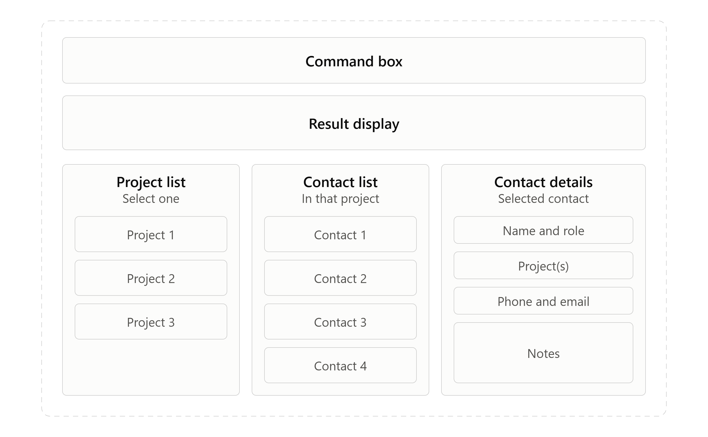

# UniTeam

UniTeam is a lightweight, local address book designed for university students who frequently collaborate on projects across different modules. It helps users store contact details, organise contacts by project, and quickly view everyone involved in a project. UniTeam provides a dedicated place to manage academic contacts separate from personal phone contacts through typed commands.

## Features

* **Add contacts** — Add contacts with the details you need for university work.
* **View contacts at a glance** — List saved contacts and retrieve their information quickly.
* **Organise projects** — Create projects and view all your existing projects in one place.
* **Assign people to projects** — Assign contacts to projects to keep track of everyone involved.
* **View project teams** — Display all contacts associated with a selected project.
* **Keep your data between sessions** — Contacts, projects, and their associations are saved locally.

## Quick start

1. Ensure that you have java `25` or above installed.
2. Download the latest `uniteam.jar` from the [releases page](https://github.com/AY2627S1-CS2103T-T08-2/tp/releases).
3. Copy the file into the folder you want to use as the home for UniTeam.
4. Open a terminal in that folder and run `java -jar uniteam.jar`.
5. Type a command box and press Enter.

## Documentation

* For project documentation, see:
  * [User Guide](docs/UserGuide.md) for using UniTeam and its commands.
  * [Developer Guide](docs/DeveloperGuide.md) for the design and implementation.
  * [Setting Up](docs/SettingUp.md) for installing the development environment.
  * [Testing](docs/Testing.md) for running the tests.
  * [UniTeam Product Website](https://ay2627s1-cs2103t-t08-2.github.io/tp/) for the published documentation.

## Acknowledgements
This project is based on [AddressBook-Level3](https://github.com/se-edu/addressbook-level3), created by the [SE-EDU initiative](https://se-education.org).
