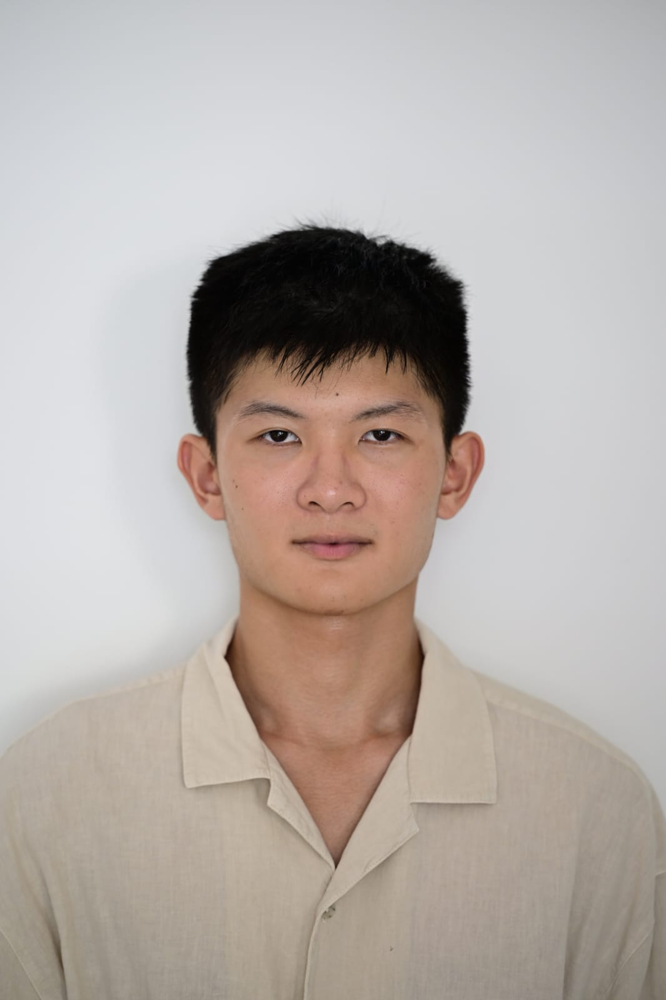
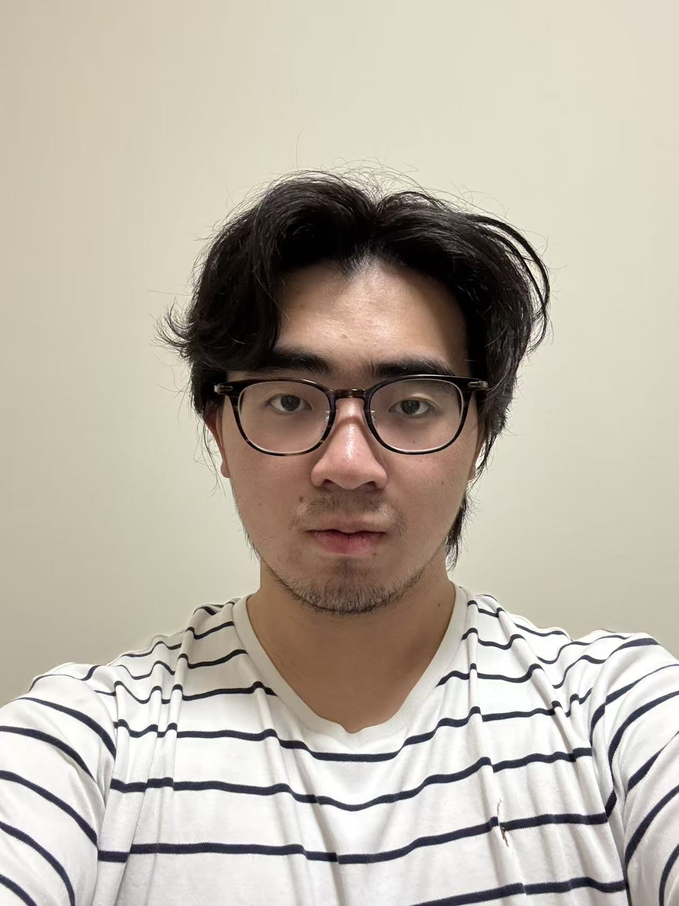

# About Us

We are a team based in the [School of Computing, National University of Singapore](http://www.comp.nus.edu.sg).

You can reach us at the email `seer[at]comp.nus.edu.sg`

## Project team

### Justen Chong

[[github](https://github.com/alrightokguy)]

* Role: Developer

### Jane Doe

[[github](http://github.com/johndoe)]
[[portfolio](team/johndoe.md)]

* Role: Team Lead
* Responsibilities: UI

### Johnny Doe

[[github](http://github.com/johndoe)] [[portfolio](team/johndoe.md)]

* Role: Developer
* Responsibilities: Data

### Joshua Eu Guang En

[[github](http://github.com/honeybee101)]

* Role: Developer
* Responsibilities: Features

### Joshua Tan Jek Chee

[[github](http://github.com/smilesocute)]

* Role: Developer

### Zhou Zheng

[[github](https://github.com/ZhouZheng152)]

* Role: Developer
